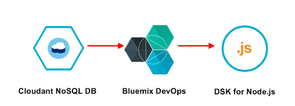
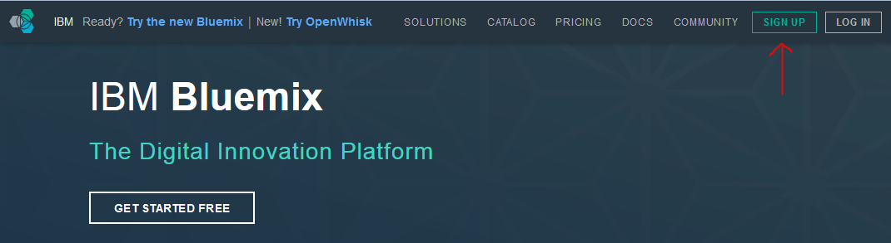
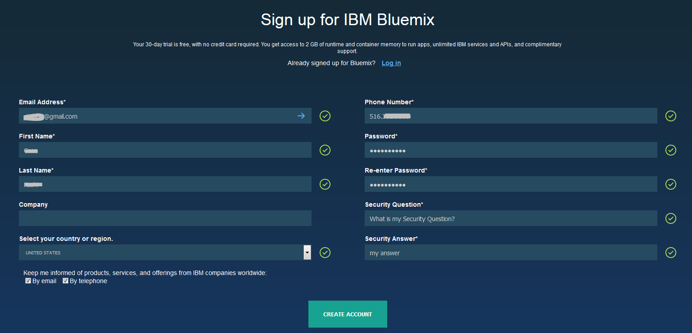
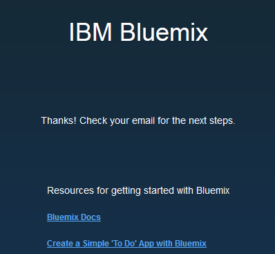
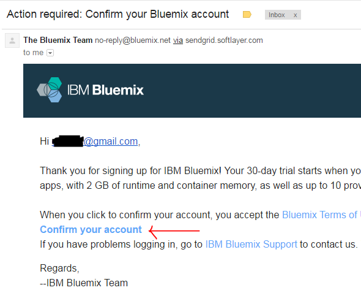
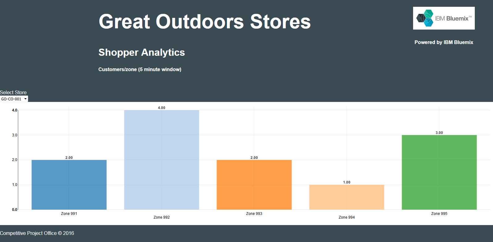

Introduction
============

> As an Application Developer you need many services and programming languages with access to unified data platform. IBM DataWorks BlueMix provides many programming languages and services as well as an integrated DevOps to build, run, deploy and manage applications on the cloud.
>
> Perform these hands-on exercises to build and deploy a live dashboard with Node.js and connect to document data store, IBM Cloudant based on CouchDB.

Lab Components: IBM Bluemix Cloud Offering Used
===============================================

1.  **Source Data Repository**: **Cloudant NoSQL DB**

2.  **Software Development Tools**: **dDevOps Services and Git **

3.  **Runtime Environment**: **SDK for Node.js**

Before You Begin
================

1.  Download Lab-NodejsDashboard.zip archive from the github.com location below and save to your laptop:

2.  https://github.com/ibmdataworks/sigmo-demos/tree/master/application-developer/nodejsDashboard.zip

> NOTE: If you don’t have a Bluemix account then get started for free by registering using the following steps:

1.  Go to [www.bluemix.net](http://www.bluemix.net)

2.  Click the signup button on the top right

> 

1.  On the next page fill in the corresponding fields and click “Create Account”

> 

1.  You will see a page asking you to check your email for next steps. Check your email that you used to sign up for Bluemix

> 

1.  Click on the “confirm your account” link

> 

***Start of Lab***

Initialize Source Data Repository: Cloudant NoSQL DB Service
============================================================

1.  From the Bluemix dashboard catalog menu search for “Cloudant”

2.  Click on the Cloudant Icon  under the Data & Analytics section.

3.  Choose the default pre-filled values in the fields (optionally rename the “Service name:” to AD-Greatoutdoors-DB), select the “Lite Pricing Plan” and click “Create” at the bottom of the page.

4.  In the top, right corner of the page click **Launch**

5.  The Cloudant page will open in a new tab. Select the new tab.

6.  Select the **Databases** tab on the left-hand navigation bar

<!-- -->

1.  In the top navigation bar select “**Create Database**”

2.  Create a new database named “**greatoutdoors**” (*Note: database names are case sensitive*). Click **create** to finalize the creation.

3.  In the following steps we will create two indices to allow queries against the data set. Note: Any parameter which is used in a query must be indexed.

4.  Click the + symbol on **Design Documents**.

5.  Select **Query Indexes**

6.  Click in the **Index** text box and select all the text

<!-- -->

1.  Replace the text with the following text:

> {
>
> "index": {
>
> "fields": \[{"evictTS" : "asc"}, "storeID", "zoneID"\]
>
> },
>
> "name" : "evictTS-index",
>
> "type" : "json"
>
> }

1.  Click “**Create Index**”

2.  Click on the **greatoutdoors** database to return to the database page.

3.  Create another index by selecting all the text in the existing index box and replacing it with the following text:

> {
>
> "type": "text",
>
> "name": "text-index",
>
> "index": {}
>
> }

1.  Click “**Create Index**”

> *Note: If the creation of either index fails, check to be sure that the double quotes have not been mangled by the cut-and-paste process. They should be standard double quotes and not inverted.*

1.  You are now ready to move to the next service – SDK for Node.js Runtime. Return to the previous browser tab and click on the **catalog** button in the top navigation bar.

Initialize Target Data Repository: SDK for Node.js Runtime Service
==================================================================

1.  From the Bluemix catalog menu search for “**foundry**”.

2.  Click on the **Cloud Foundry Applications** icon 

3.  Click on the **SDK for Node.js** icon 

4.  Create a name the service and the host. *Note: The host name needs to be unique. If you receive an error message it is likely that the host name you created is already in use.*

5.  Choose the default pricing plan and click “**Create**” at the bottom of the page.

> *Note: Allow your new SDK for Node.js runtime service to stage. This could take 30-40 seconds.*

1.  Click on the “**Connections**” tab in the top navigation bar when staging is complete.

    1.  Click on the blue “**Connect Existing**” button on the top, right side of the page.

    2.  Click on the **NoSQL Cloudant DB** service you created in section 4 and click **Connect**

    3.  You will be prompted to restage your application. Click **Restage**.

    4.  *Note: Allow 30-40 seconds for your application to restage.*

    5.  Binding services allows the Node.js service to authenticate to Cloudant without hard coding credentials in the JavaScript code. It uses environment variables on the server-side to share the credentials between services.

2.  In the top, navigation bar click the “**Overview**” tab.

    1.  In the Continuous Delivery panel select “**Add Git Repo and Pipeline**”

    2.  If you already have a jazz.net account bind with that account. Otherwise, enter a n alias (account name) to allow Bluemix to create a Dev Ops account for you.

    3.  Accept the DevOps Services terms by ticking the box.

    4.  Click **Create**

    5.  Once your Git account has been created you will be notified. Click **Continue**

    6.  Once the Git repo has been create you will be prompted:

> *Populate the repo with the starter app package and enable the Build & Deploy pipeline?*

1.  Tick the box and click Continue

2.  Once the Git repo is created you will be notified. Click **Close**

3.  In the Continuous Deliver panel select Configure

4.  You should see two stages which have been created for you. One for Build and the other for Deploy.

<!-- -->

1.  DevOps Service for Bluemix

    1.  Click on the settings “star” icon for the **Build Stage** and select **Configure Stage**.

    2.  Select **Input** tab

    3.  At the bottom of the screen change “**State Trigger**” from “Run jobs whenever a change is pushed to Git” to “Run jobs only when this stage is run manually”.

    4.  Click “**Save**”

2.  Return to your Git repo

    1.  Select “**Edit Code**” on the top navigation bar

    2.  In the left-hand pane click on the top entry with the twisty icon. We are going to import code and it is important that we import it to the root of the folder.

    3.  In the Application Menu select File -&gt; Import -&gt; File or Zip Archive

    4.  Browse to the zip file you downloaded in the Before You Begin section.

    5.  You will be prompted if it should unzip the .zip file. Click **OK**.

    6.  The import will fail and then ask *“Would you like to retry the import with force overwriting?*”. If you are not prompted the import may have failed.

    7.  Click **Yes**.

    8.  You will need to edit **Manifest.yml** to change the location where the application is hosted. Change both occurrences of NodejsDashboard to the name of your mybluemix.net host route. The host is usually the same name as your project unless there was a conflict. Note: The file will save automatically.

3.  In the left-hand navigation bar click the **Git** icon  just below “**edit code**”

    1.  Allow the page to completely refresh all the code changes. You should see 11 files selected in the right-hand pane.

    2.  Enter a comment into the comment window and click **Commit**.

    3.  In the **Outgoing** source tab on the left side of the page click **Push**. This will deliver (push) the commits to the server.

4.  DevOps Service for Bluemix

    1.  Select **Build and Deploy** on the top navigation bar

    2.  Click the play button on the **Build stage** to build the newly delivered code. If the build is successful the Deploy stage should start automatically and deploy your code to the server.

    3.  Once the Deploy stage has completed and passed, right click on the application URL and **open in a new browser tab** by right clicking on the URL.

5.  Node.js runtime Service

    1.  Browse to your mybluemix.net URL where your web application is hosted. You should see a d3.js graph with 5 bars representing the 5 zones in the store.

    2.  After 30 seconds, the application should read from the Cloudant database and the values for each store should change.

***End of Lab***
