
#Hands on Lab - Business Analyst.

As a Business Analyst, you need to analyze, discover and visiualize business data to derive insights. Perform these hands-on exercises using guided exploration capabilities with IBM Watson Analytics platform on customer transaction data to uncover unique insights about product affinities.
 
Watch Full Lab Video (Optional): https://youtu.be/T6Aa448WcU4

 > 

#Step 1. Get a free IBM Watson Analytics account...

1.  Open a browser and go to “watsonanalytics.com”. This will redirect you to the URL: <https://watson.analytics.ibmcloud.com/product> and click on “TRY IT FOR FREE” button as shown below:
 > 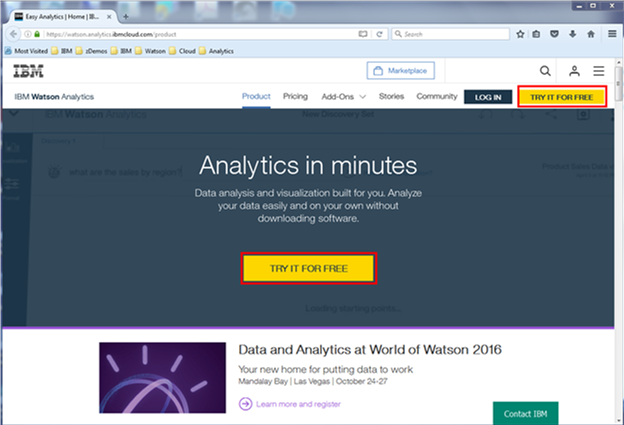
   
2.  You have the option to click on “View pricing and buy” from the next screen. Watson Analytics provides 2 paid editions “Plus” and “Professional” with monthly license charges of $30 and $80, with included storage of 2GB and 100GB respectively. For now, let’s go with the “Free” license and click on “Try free edition”. To read more about the editions, please check out: <https://www.ibm.com/analytics/watson-analytics/us-en/solution/editions>
 > 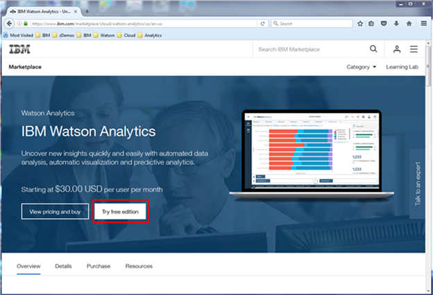

3.  You will be taken to the “Purchase” page, from where click on “Try free edition”. This will set up a “Free” account that supports 1MB of storage for a single user for an indefinite period and a 30-day trial of the Professional single user account. The “Free” account only allows text files to be uploaded into Watson Analytics, whereas from Professional Account you can bring in a variety of data sources on the cloud and on-premise with up to 100GB of storage (additional storage can be purchased at $50 per month per 50GB).
 > 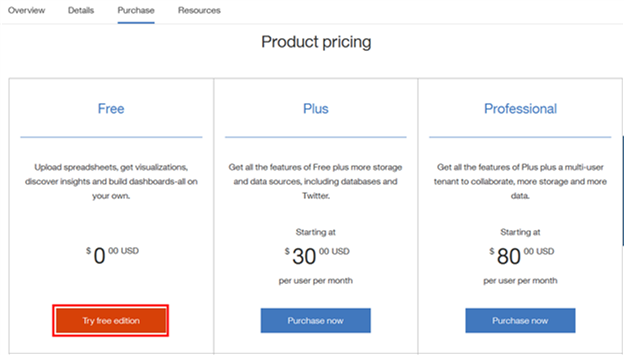

4.  You will now be prompted to setup an IBMid using the sign-up form as shown below. However, if you already have an IBMid, you can click on “Already have an IBMid” as highlighted below and sign-on with those credentials to request Watson Analytics account setup.
 > 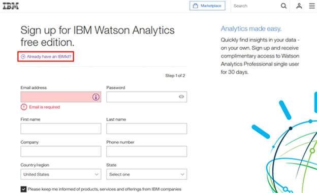

5.  To activate your IBMid, you will be sent an email by ibmacct@us.ibm.com with a “Confirmation code” (7 digit number), that you can retrieve from your email box and type it on the sign-up page as shown below.
 > 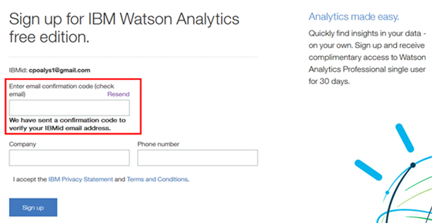

6.  At this point, you will see a status screen saying “Your services are being setup” but within a few seconds your account will be setup and you’ll see a page as below confirming your 30-day trial subscription to “IBM Watson Analytics Professional Single User”!
 > 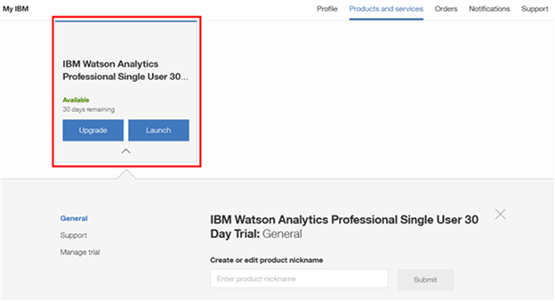

7.  You can now login to Watson Analytics by clicking on “Launch” button or directly go to Watson Analytics sign-on site from the homage watsonanalytics.com. After you login, you should see the page below and you are now ready to upload data for an amazing experience of guided self-service analytics!
 > 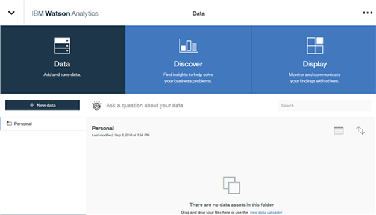

#Step 2. Hands on Exercises...

1.  Logon to Watson Analytics by going to page “watsonanalytics.com” on a browser and clicking on “LOG IN” blue button on the top right. 

 > 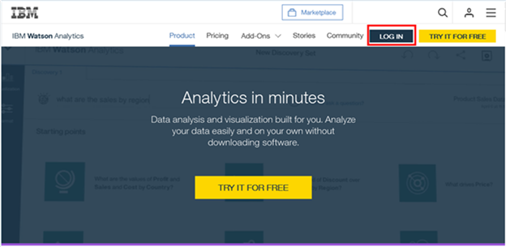

2.  Click on “+ New data” button towards the top left as highlighted below. This will let you add a new dataset to your “Personal” folder.

 > 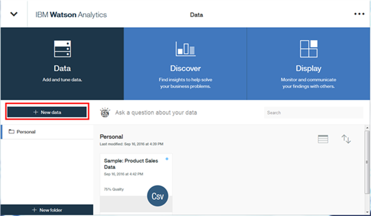

3.  You should now be able to read in a spreadsheet “Great Outdoor Customer Orders.xlsx” that you can download from the Github link: <https://github.com/ibmdataworks/sigmo-demos/tree/master/business-analyst>
    Click on “Local file” to import the dataset into Watson Analytics.
    
 > 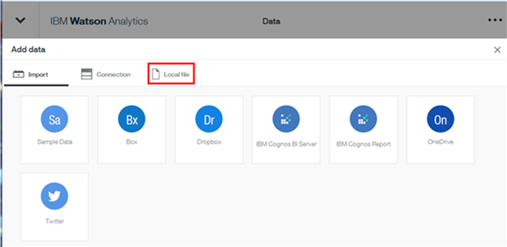

4.  You can now either drag and drop the spreadsheet or click on “Browse” to select the file from the folder where you downloaded the dataset from Github.

 > 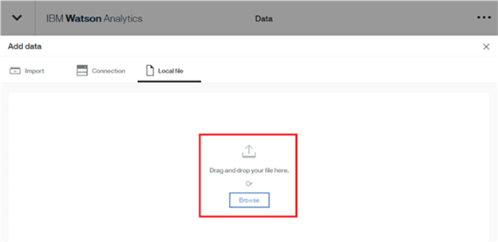

5.  Next, you should see an icon for the file on the screen and now click on “Import” button on bottom right to upload the spreadsheet to Watson Analytics.

 > 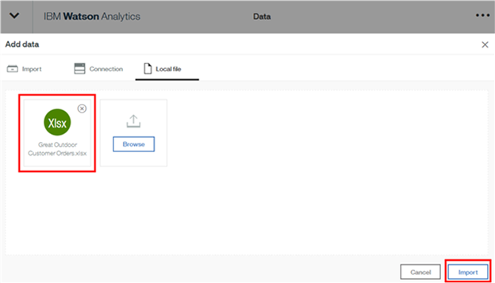

6.  In less than a minute (usually within 30 seconds), the input file is uploaded and processed and shows up as an entry in the Personal folder as shown below. Watson Analytics processes the file to measure its usefulness for analytics and computes a data quality score. The data quality score (77% for this file) is computed as an average of the score of all fields and is influenced by missing values, constant values, imbalance (skews and outliers). To read more about data loading and data quality, please check out: <https://community.watsonanalytics.com/discussions/storage/attachments/816-watson-analytics-intro-to-data-v-2-1.pdf>

 > 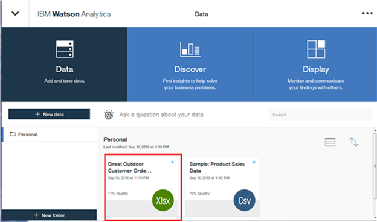

7.  You are now all set to start looking at the interesting insights Watson Analytics automatically finds from the data. Just click on the dataset and you’ll be taken to a screen labelled as “New Discovery Set” as shown below. As “Starting points”, 6 different visualizations are automatically recommended for you to explore (you can click on “Show Next” on the top right to see the next set of guided visualizations), but you can create your own visualization selecting from the 20 different chart types in the bottom of the screen. You also have an option to type in a natural language question on the top and Watson Analytics will suggest an appropriate visualization that likely answers that question! 
 > 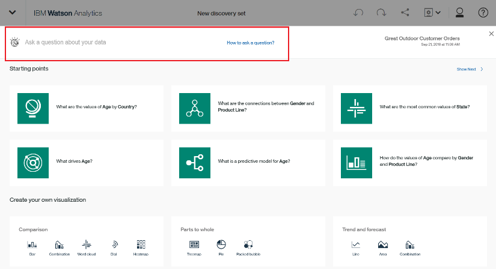

8.  Let’s scroll back to the top and type in a question “Show the breakdown of Transactions by Product Line and Product Type” and hit enter. You will automatically be provided a set of starting points starting with the most relevant visualization that helps answer your question! Let’s click on the tree map on the top left (the first visualization listed as “Most relevant” under “Starting points”).

 > 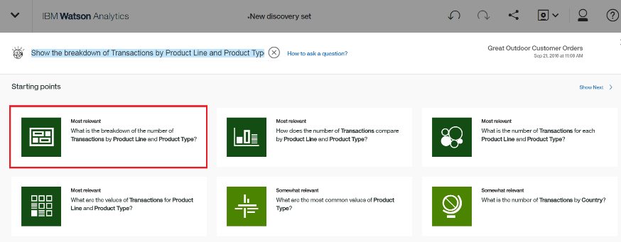

9.  Since each row of the spreadsheet is a customer transaction, the size of the rectangles in the Treemap represents the number of transaction for each product type such as “Tents”, “Sleeping Bags”, “Eyewear” etc. We can clearly see that most popular item for Great Outdoors is “Eyewear” and if you hover your mouse over that brown rectangle under “Personal Accessories”, it tells you that there were a total of 8,264 transactions (out of a total of 62K transactions) for “Eyewear”! The next best selling items in terms of total volume are “Tents” and then “Sleeping Bags”.

 > 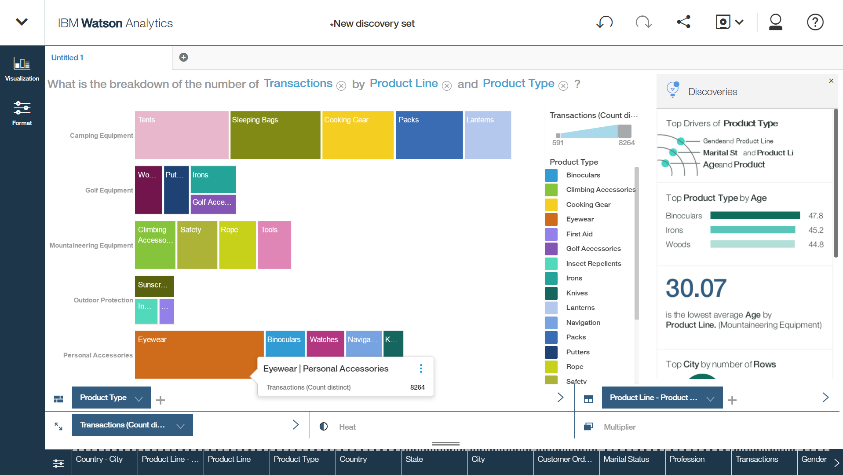

10. Several other automatically generated “Discoveries” are drawn on the right, but let’s click on the “x” button to close that pane, so as to lay out the Treemap across the entire screen to better visualize the chart. Now, let’s add a field to the “Multiplier” data slot as highlighted on the bottom right by clicking on it and then selecting “Gender” from the pulldown list.

 > 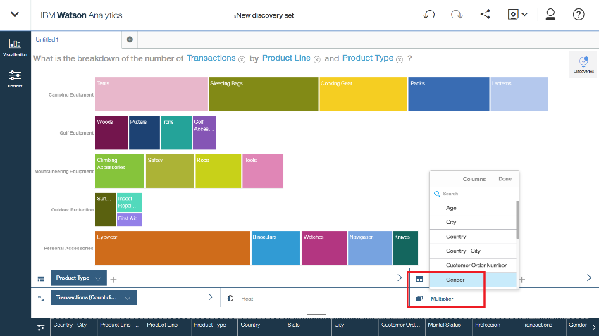

11. On the text box that pops up, make sure to click on arrow to the right of “Multiplier Mode” and select “Vertical”. This will lay out the Treemaps for Females and Males, one below the other (versus the default “Horizontal” option, which is next to each other). This helps better use the screen space to see the Treemap more clearly for each Gender and observe the similarities and differences.

 > 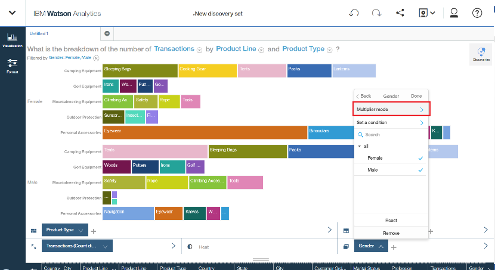

12. Now comparing the Treemaps for the Women and Men respectively, we can clearly see that the most popular item for Women is “Eyewear”, whereas for Men, it is “Tents”! In the “Camping Equipment” category, Women buy more “Sleeping Bags” and then “Cooking Gear”.

 > 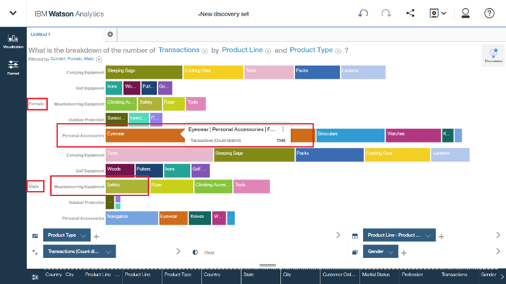

13. Let’s now add a title to this visualization by clicking on “Untitled 1” on the tab to the top left and then click on the pencil icon as shown below to type in a title “Product Type vs Gender”.

 > 

14. We will create a new visualization now to see the correlation of Age and Gender to Product Line. Click on the “+” button to the right of the title tab of the visualization you just created as shown below:

 > 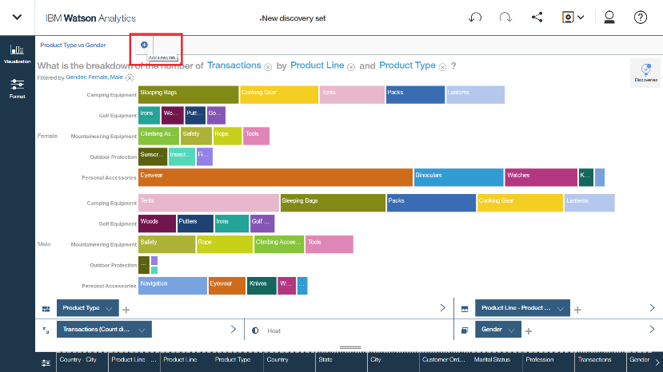

15. You will be prompted with 6 “Starting points” again and instead of typing in a natural language question (you can type on the text box on the top left “How do the Transactions compare by Age and Product Line”) , let’s create this new visualization by scrolling to the bottom and under “Create your own visualization”, pick the chart titled as “Bar” under “Comparison”. There are 20 different chart options categorized as “Comparison”, “Parts to whole”, “Trend and forecast”, “Relationships”, “Tables and Summary”, “Predictive …” and “Geospatial”.

 > 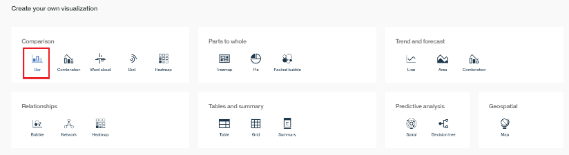

16. First, dismiss the “Discoveries’ pane on the right by clicking on the “x”, so as get more space to draw out the bar chart. You will see a sample “Bar Chart” and you have to now pick fields for the categories, “Bars”, “Length”, “Color” and “Multiplier”, as shown on the bottom of the chart as below:

 > 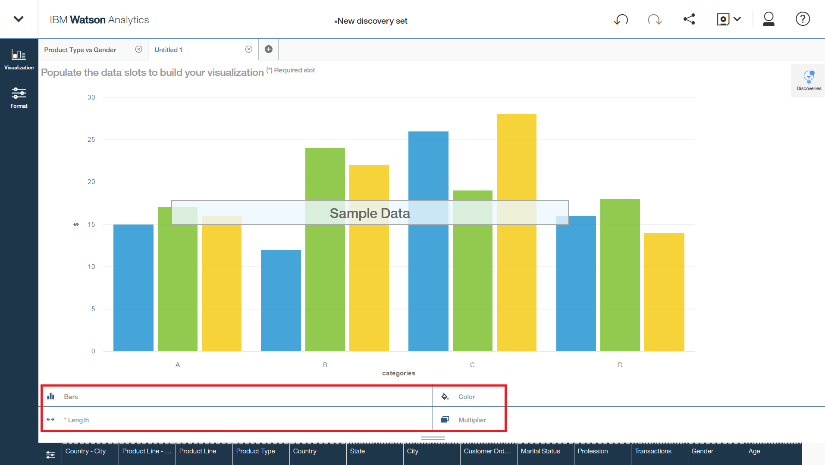

17. Drag and drop “Age”, “Transactions” and “Product Line” on “Bars”, “Length” and “Color” data slots respectively.

 > 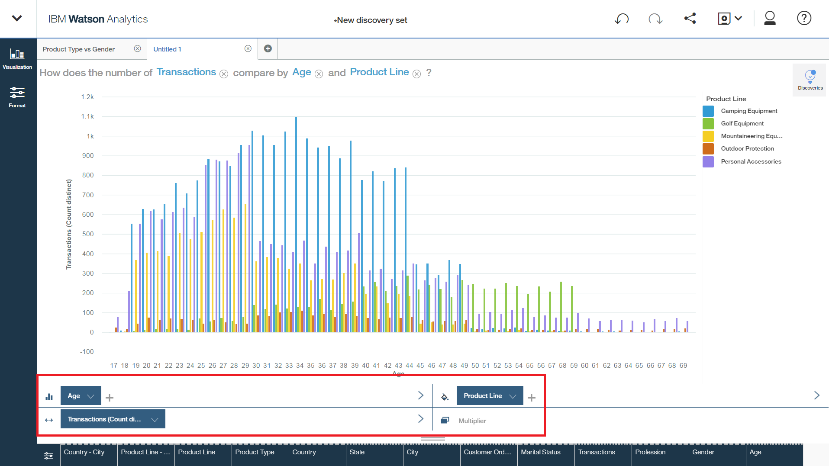

18. Now click on “Format”, expand “Variations” and perform the following - select “Stacked” and de-select “Swap Axis”. That enables your bar chart to be stacked and presented in a horizontal fashion and enhances the overall visibility of the visualization.

 > 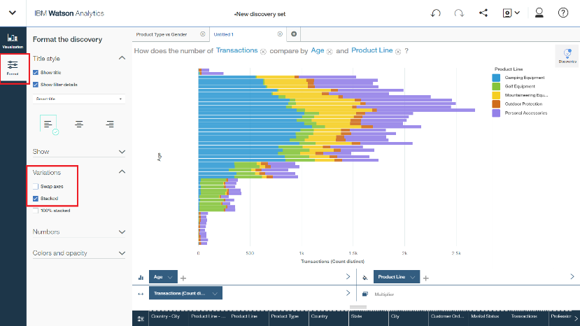

19. Just drag and drop “Gender” from the data tray below to the “Multiplier” data slot.

 > 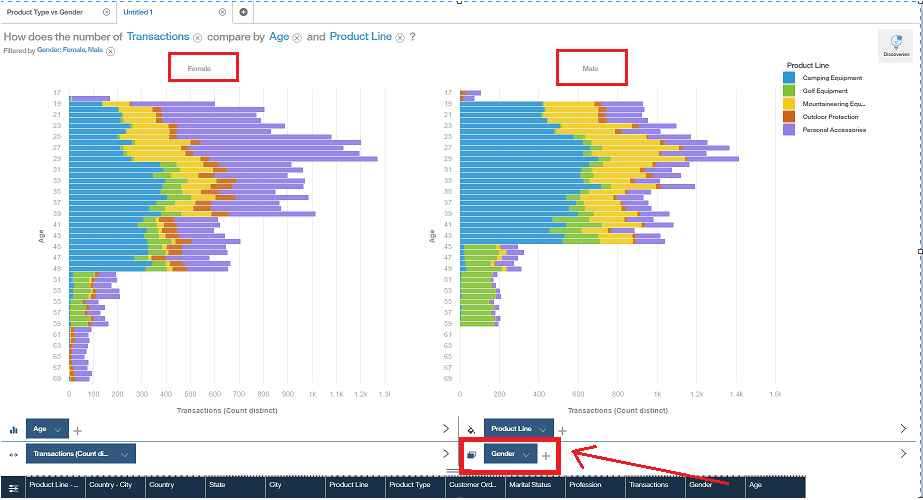

20. As you compare these, you’ll notice that Females below 30 years of age buy more “Personal Accessories” (shown in purple) and those between 30 and 48 buy more “Camping Equipment” (shown in blue).

 > 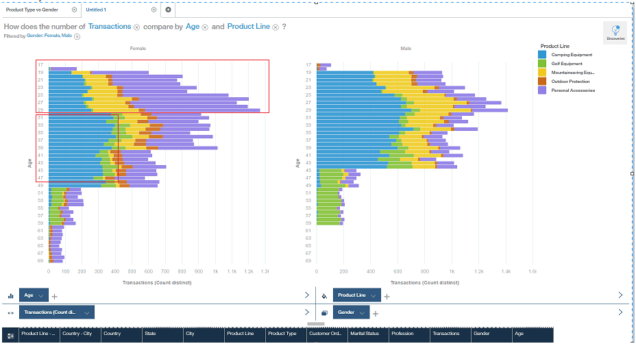

21. As for the Males below age 44, they mostly buy “Camping Equipment” (shown in blue) and those older buy “Golf Equipment” (shown in green).
 > 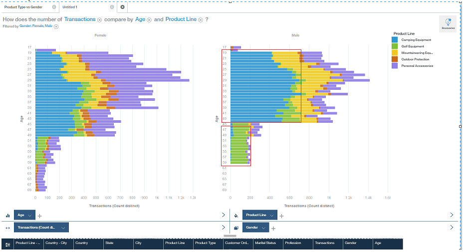

22. You can now rename this tab as “Product Line vs Age and Gender” and save the “New discovery set” you just created by clicking on the “floppy disk” icon <embed src="./media/image29.emf" width="24" height="20" /> and selecting “Save as”, as shown below.

 > 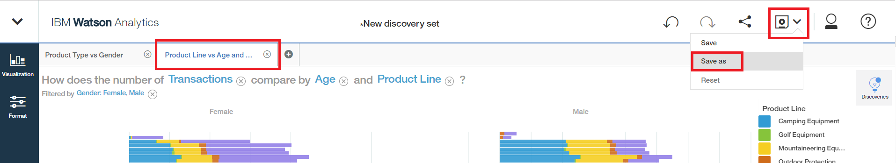

23. On the “Save as” text box that pops up, type “Great Outdoors Customer Order Insights” on the top left and save it in the “Personal” folder (only option available by default, unless you create new folders yourself) by clicking on the “Save” push button on the bottom right.

 > <embed src="./media/image31.emf" width="284" height="266" />

24. We will create one last visualization that will show us the attributes that drive “Product Line”. Click on the “+” and type a question “What drives Product Line” on the top left as shown below and hit enter.
    Watson Analytics returns with 6 resulting insights for you to choose from. Click on the most relevant (top left) Spiral Visualization as shown below.
    
 > 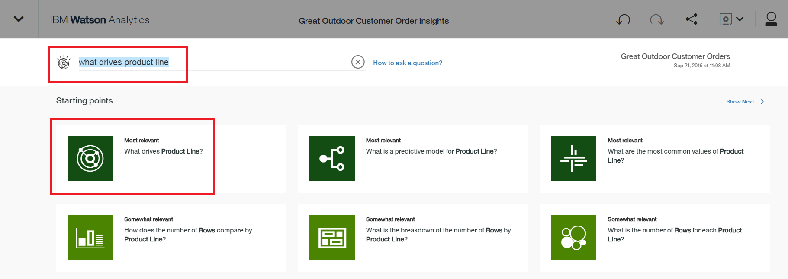

25. Click on ‘View more’ to see the entire list of factors arranged in order of their predictive strengths. You should see the top predictor as “Product Type” with 100% strength (since each Product Line has a set of unique Product Types) right at the center of the bulls-eye and then the next relevant attributes are “Profession and Gender” and “Professional and Age” respectively, each with 50% predictive strength. Click on the “Untitled 1” label for this discovery on the tab on the top right and then click on the “pencil” icon and type in the label “Drivers of Product Line”. You should now see the discovery as below:

 > 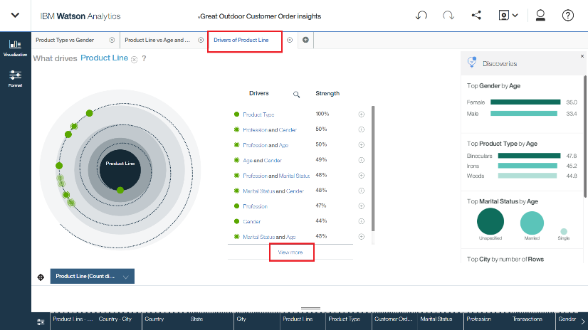

26. The predictive insight gleaned from the “Spiral” chart says a Data Scientist can explore building machine learning models such as a “Decision Tree” using the same data with the “Data Science Experience” (DSX) too. There’s a separate lab exercise for the Data Scientist that does exactly that and you’re welcome to try that next!

27. Congratulations, you’re done with the lab exercise!
